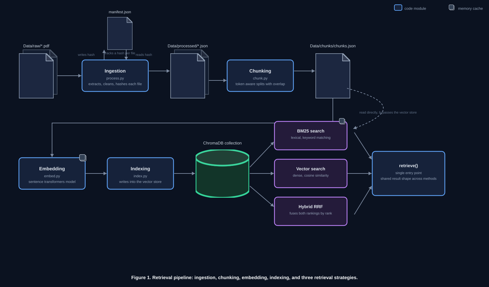
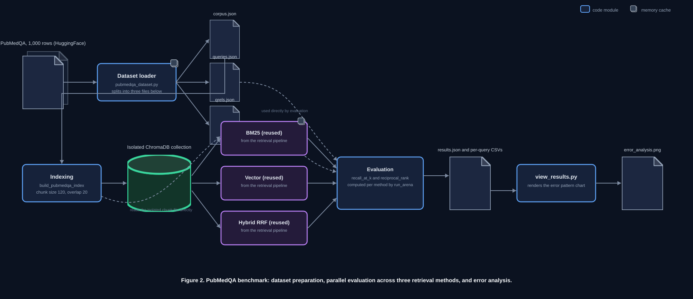
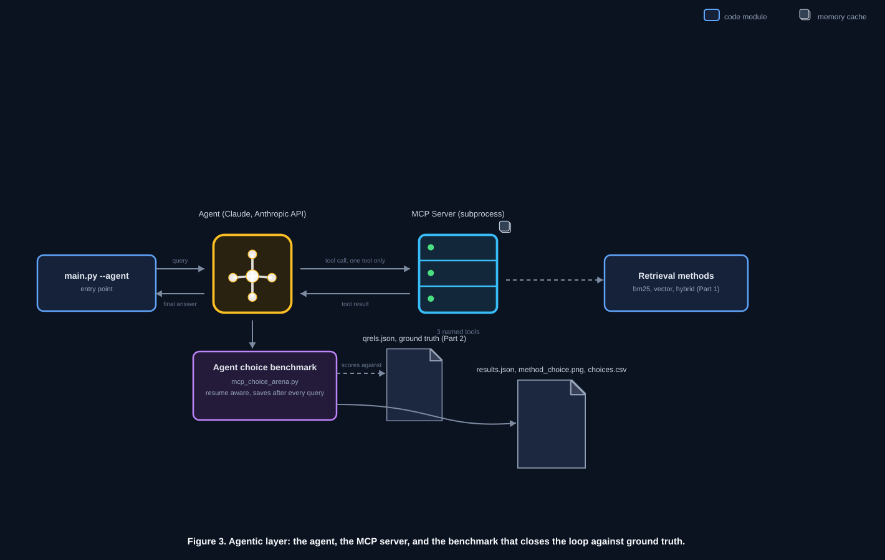

# AgenticRAG-Router

[](https://www.python.org/)
[](https://www.trychroma.com/)
[](https://pypi.org/project/rank-bm25/)
[](https://www.sbert.net/)
[](https://github.com/openai/tiktoken)
[](https://www.anthropic.com/)
[](https://modelcontextprotocol.io/)
[](https://docs.pytest.org/)
[](https://pymupdf.readthedocs.io/)
[](https://www.docker.com/)

**A production-style RAG pipeline where an LLM agent chooses its own retrieval strategy through MCP, benchmarked against static baselines on 1,000 real biomedical questions.**

Built from scratch, no LangChain or LlamaIndex, so every stage (chunking, embedding, indexing, retrieval, fusion) is explicit rather than hidden behind a framework call.

## At a glance

| | |
|---|---|
| Language | Python 3.12 |
| Size | ~1,470 lines of source, ~2,110 lines of tests, 156 tests, 45 commits |
| Benchmark | PubMedQA (`pqa_labeled`), 1,000 real biomedical question and abstract pairs |
| Retrieval methods | BM25, dense vector search, hybrid RRF fusion, each exposed as a named MCP tool |
| Agentic layer | An LLM agent selects the retrieval method per query via the Anthropic API and MCP |
| Headline finding | Unweighted hybrid RRF underperforms plain vector search on this benchmark. Root cause traced query by query, not just observed. |

## Why this exists

Most RAG projects assume hybrid retrieval is the safe default and stop there. This one tests that assumption directly: it builds all three retrieval strategies independently, evaluates them on a real information retrieval benchmark, and finds a case where the "safe default" actually loses to the simpler method. It then goes one step further and asks whether an LLM agent, given all three strategies as tools, would have picked the winning one on its own.

## Architecture



```
Data/raw/*.pdf
      | ingestion/process.py   extract, clean, strip headers and references, hash
      v
Data/processed/*.json    one file per source, page-level documents
      | ingestion/chunk.py      sentence-aware chunking, token budget and overlap
      v
Data/chunks/chunks.json   every chunk from every source
      | index/index.py          embed, store with a targeted update, not a full rebuild
      v
vectordb/                 persistent ChromaDB collection
      | retrieval/retrieve.py   bm25_search / cosign_simularity / search_hybrid_rrf
      v
retrieve(query, method) -> ranked results
      | mcp_server/server.py    same three methods exposed as named MCP tools
      v
mcp_server/client.py      agent selects a tool via the Anthropic API, executes it, answers
```

Every stage past extraction is idempotent at the individual file level. A manifest tracks a content hash per source file, so adding one new document to the corpus reprocesses only that document, not the rest of the corpus.

## Results on PubMedQA, 1,000 questions



| Method | Recall@1 | Recall@5 | MRR |
|---|---|---|---|
| BM25 | 0.886 | 0.944 | 0.913 |
| Vector | 0.972 | 0.989 | 0.980 |
| Hybrid RRF | 0.946 | 0.989 | 0.963 |

Vector search alone wins on every metric. Hybrid, the usual default, underperforms it.

<details>
<summary><b>Why hybrid loses here</b></summary>

<br>

Reciprocal Rank Fusion combines two rankings by summing 1 / (k + rank) across both, with no notion of which ranker is more trustworthy. That is a reasonable assumption when both rankers are roughly comparable in quality. It does not hold here: vector search is already close to ceiling at 97 to 99 percent, and BM25's failures on this corpus are not "ranks it low," they are "does not retrieve it at all."

Tracing every query directly: hybrid fixed 12 questions vector search had gotten wrong, but broke 38 questions vector search had gotten right, a net loss of 26. In 66 percent of those 38 breaks, the correct document was completely absent from BM25's own candidate pool, so it got zero support from fusion, while a wrong but jointly-supported document, typically BM25's confident top pick given mild credibility by vector search, won the combined vote instead.

Vector and hybrid tie on Recall@5, both miss only 11 of 1,000 questions, but the shape of the misses is opposite. Vector's failures are mostly clean losses, the answer is nowhere in the top 10. Hybrid's failures are mostly demotions, the answer is still findable but pushed down to rank 2 through 5. Recall@5 does not penalize a demotion, MRR does, which is why hybrid's MRR is worse than vector's despite identical Recall@5.

Full per-query traces, error tables, and the supporting chart are in `results.md`.

</details>

## The agentic layer



Three retrieval methods are exposed as three separately named MCP tools, `bm25_search`, `vector_search`, and `hybrid_search`, rather than one tool with a method parameter. That choice is deliberate: naming them separately makes the model's choice legible as the tool name itself, directly loggable and comparable against the benchmark results above.

`main.py --agent "question"` routes the query through the Anthropic API with all three tools attached and tool choice forced to pick exactly one. Parallel tool calls are disabled, since "choose which one" only means something if exactly one call happens. Whichever tool gets called executes through a real MCP session over stdio, and the result is sent back for a final synthesized answer.

<details>
<summary><b>Engineering decisions behind the MCP server</b></summary>

<br>

- Tool descriptions state mechanism and a neutral rule of thumb only. They deliberately avoid saying vector search is empirically best, since a future comparison of the model's choices against the benchmark's ground truth would otherwise be circular.
- Standard output is redirected to standard error around every retrieval call, since a stray print on an error path would corrupt the JSON-RPC stream MCP depends on.
- The MCP library is pinned to version 1.29.0, not the newer 2.0.0. The newer release had dropped the documented decorator-based server API in favor of a far less-documented one, confirmed by inspecting the installed package directly rather than assumed from a changelog.
- Verified end to end against a real Anthropic API key, not just mocks. The agent chose `vector_search` for a real query and produced a correctly grounded answer, confirming the full chain from subprocess spawn through MCP handshake, tool call, retrieval, and synthesis.

</details>

**A second benchmark tests the agent itself, not just the retrieval methods.** `benchmarks/mcp_choice_arena.py` runs the same PubMedQA questions through the agent: for each one, it records which tool the agent chose, scores that choice's actual retrieval results against the same ground truth used above, and compares the result to a vector-only baseline computed on the identical question set. Since every question is a real, billed API call, results are saved incrementally after each one rather than only at the end, so a run stopped partway still leaves complete, plottable results for everything finished so far.

<details>
<summary><b>Result: does the agent rediscover the winning method on its own?</b></summary>

<br>

Run on the full 1,000-question set, with tool descriptions that never hint which method performs best:

| | Recall@5 | MRR |
|---|---|---|
| Claude's chosen method | 0.982 | 0.962 |
| Vector-only baseline | 0.989 | 0.979 |

Claude picked hybrid RRF 68% of the time (681/1,000), vector 24% (240/1,000), and BM25 8% (76/1,000) — defaulting toward the conventional "hybrid is the safe choice" assumption rather than the method this project's own benchmark already showed wins here. Tracing the 36 questions where Claude's pick scored worse than vector alone, 26 reproduce the exact demotion pattern from the headline finding above: the correct document stays in the top 5 but gets pushed down from rank 1, which Recall@5 doesn't penalize but MRR does. A separate, smaller failure mode also showed up: 3 of the 1,000 calls named a tool that was never offered, correctly scored as a clean miss rather than crashing the run.

Full breakdown, per-query traces, and the chosen-method chart are in `results.md`.

</details>

## Engineering highlights

- **Idempotent pipeline.** A per-file content hash means adding one document to the corpus reprocesses only that document, confirmed by checking the exact vector count delta after a real change, not assumed from the code.
- **Token-aware chunking.** Chunk size is measured with `tiktoken`, not characters or words, since token count is what actually determines whether text fits an embedding model's input window.
- **A benchmark methodology built to survive scrutiny.** An early version of the internal timing benchmark ran all of one method's trials before the other's, which let system-level noise systematically favor whichever ran in a better window, and reported no variance. Rebuilt to interleave trials and report mean and standard deviation across three corpus scales.
- **Bugs found by running the pipeline against its own output, not just by testing.** A query embedding mismatch that was silently correct by accident, a reference-stripping heuristic that let entire bibliography pages through, and a downstream stage that kept re-embedding the whole corpus even after idempotency correctly flagged only one changed file, were all caught this way.

<details>
<summary><b>Full list of bugs found and fixed</b></summary>

<br>

**Pipeline**
- `cosign_simularity` originally let ChromaDB fall back to its own default embedder instead of the project's configured one. It happened to match in this case, but was correct by accident and would have silently diverged the moment the embedding model changed.
- The reference-stripping heuristic counted citation markers only at the start of each line, which missed bibliography pages where a single citation wraps across several lines. A real query for "machine learning algorithms" returned mostly raw citation text before the fix. 27 of 147 chunks were pure bibliography before the fix, 0 after.
- The sentence splitter treated `"et al. "` as a sentence boundary, leaving chunks that opened mid-sentence with no context for the fragment that followed.
- The idempotency signal was computed correctly by the manifest but then ignored by the downstream chunking and indexing stages, which kept re-processing the entire corpus regardless. Caught by inspecting actual chunk and vector counts after a single-file change, not by a failing test.

**MCP and agent**
- A `top_k` parameter was accepted by the agent's request function but never referenced in its body, so two callers passing different values behaved identically. Fixed by folding it into the prompt explicitly and verifying the sent text at two different values.
- A real API failure surfaced as an unreadable nested exception group, since the MCP stdio client's async internals wrap failures in ways a plain except clause does not catch. Fixed with a recursive walker that finds the real exception inside arbitrarily nested groups.

**Testing**
- A test mocking three sequential calls with one shared `return_value` dict caused the second and third calls to see an already-mutated dict, since production code pops a key from each result. Fixed by using `side_effect` so each call gets a fresh object, matching real behavior.
- `MagicMock(name=...)` does not set a `.name` attribute, since `name` is reserved by the mock library's own constructor. Has to be assigned after construction instead.
- An `lru_cache`'d helper's cache persisted across the whole test session, letting a stale value from one test leak into the next. Fixed with an autouse fixture that clears it before and after every test.

</details>

## Known limitations

- The production ingestion pipeline has only been exercised against 3 sample PDFs.
- Idempotency tracks extracted text, not chunking logic. A change to chunking rules alone will not trigger a reprocess for files whose underlying text did not change.
- The agent-vs-baseline comparison (`benchmarks/mcp_choice_arena.py`) has now been run on the full 1,000-question set: the agent defaults to hybrid RRF most of the time and scores measurably below the vector-only baseline as a result (see the agentic layer section above).
- `--agent` mode makes live, billed Anthropic API calls. Everything else in this project is local and free to run.

## Running it

```bash
pip install -r requirements.txt

python build_index.py                          # build or refresh the index from Data/raw/*.pdf
python main.py "your question"                  # direct retrieval, default method
python main.py --method bm25 "your question"     # force a specific method
python main.py --agent "your question"            # let the agent choose (needs ANTHROPIC_API_KEY)

python -m benchmarks.pubmedqa_arena             # re-run the PubMedQA benchmark
python view_results.py                            # view the per-query error analysis chart
python -m benchmarks.mcp_choice_arena --sample-size 30  # test the agent's own tool choice (needs ANTHROPIC_API_KEY)
pytest                                              # run the 156 tests
```

### Running it with Docker

The project is also containerized, so it can run without installing Python or any dependency locally.

```bash
docker build -t retrieval-arena:latest .

docker run --rm \
  -v $(pwd)/vectordb:/app/vectordb \
  -v $(pwd)/Data:/app/Data \
  retrieval-arena:latest "your question"
```

`Data/` and `vectordb/` are mounted in at run time rather than baked into the image, since they're runtime state (the corpus and its index), not code. That keeps the image itself generic and reusable against any dataset, and means rebuilding the corpus never requires rebuilding the image.

`requirements.txt` installs the CPU-only build of `torch`, not the CUDA one. Every direct dependency is pinned to the exact version this project is tested against, so the image resolves the same environment as local development, just without the several extra gigabytes of GPU libraries this project never actually uses.

## Project layout

```
src/retrieval_arena/
|-- config.py               central settings, sourced from .env
|-- ingestion/               extraction, cleaning, chunking, embedding
|-- index/                   ChromaDB indexing
|-- retrieval/                bm25_search, cosign_simularity, search_hybrid_rrf, retrieve()
`-- mcp_server/               server.py exposes the 3 methods as MCP tools, client.py bridges to the Anthropic API

benchmarks/                   evaluation harnesses, kept separate from library code
tests/                         mirrors src/retrieval_arena/ and benchmarks/, 156 tests
build_index.py                 root orchestrator, run the full ingestion pipeline
main.py                        root orchestrator, query directly or via --agent
view_results.py                per-query error analysis chart
Dockerfile, .dockerignore       container build, CPU-only, pinned to the exact dependency versions above
```

## Stack
Python, ChromaDB, rank_bm25, sentence-transformers, tiktoken, Anthropic API, MCP, pytest, PyMuPDF, Docker
## License

MIT, see [LICENSE](LICENSE).