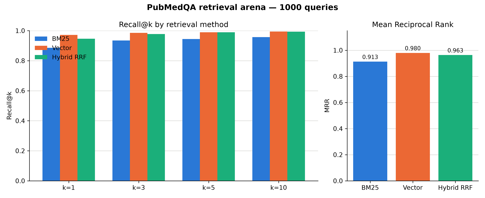
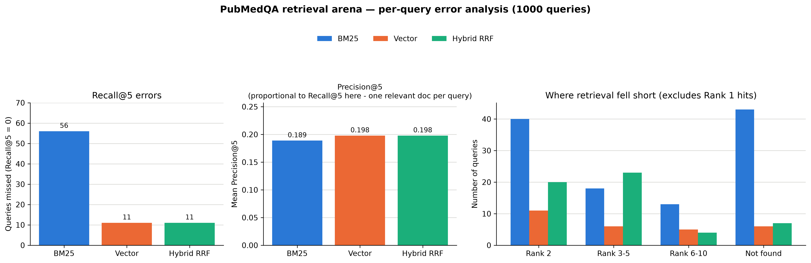
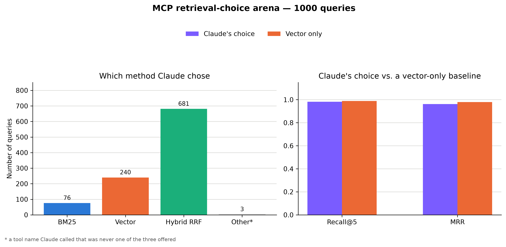

# PubMedQA Retrieval Arena — Results

This document explains what the PubMedQA benchmark found when comparing three retrieval methods (BM25, vector similarity, and hybrid RRF), and what happened when an LLM agent was given all three as tools and asked to pick one itself. The short version: vector search alone beats hybrid fusion on this dataset, and when Claude is left to choose its own retrieval strategy with no hint about which one wins, it defaults to hybrid anyway and pays for it in accuracy.

## What was tested

[PubMedQA](https://huggingface.co/datasets/qiaojin/PubMedQA) (`pqa_labeled` split) provides 1,000 real biomedical research questions, each paired with the one specific abstract it was written from. That structure makes it a clean retrieval benchmark. For every question there's exactly one correct document, so "did retrieval find the right one, and how quickly" has an unambiguous answer.

For each of the 1,000 questions, all three retrieval methods were run against the same indexed corpus, and scored with two metrics:

- **Recall@k**: did the correct document appear anywhere in the top *k* results? (yes/no, since there's only one correct document per question)
- **MRR (Mean Reciprocal Rank)**: averaged over all questions, `1 / rank` of the correct document (1.0 if it's the very first result, 0.5 if second, 0.2 if fifth, 0 if not found at all). Unlike recall, this is sensitive to how far down the correct answer landed, not just whether it showed up at all.

A third metric, Precision@k, was also computed per the project owner's request, but for this dataset it turns out to be mathematically redundant with Recall@k. See the note in Finding 3.

## Headline results

| Method | Recall@1 | Recall@5 | MRR |
|---|---|---|---|
| BM25 (keyword search) | 88.6% | 94.4% | 0.913 |
| Vector search (semantic) | 97.2% | 98.9% | 0.980 |
| Hybrid (BM25 + Vector, fused) | 94.6% | 98.9% | 0.963 |

Vector search alone wins outright, on every metric. That's the surprising part. Combining two methods is usually expected to beat either one alone, and it doesn't here.

## Finding 1: why "hybrid should win" doesn't hold on this dataset

Hybrid search uses a technique called Reciprocal Rank Fusion (RRF). It runs both BM25 and vector search, then combines their two rankings into one, giving more weight to documents that rank highly in either list. This normally helps because the two methods tend to have different weaknesses. BM25 is good at exact keyword and terminology matches that vector search can miss, and vector search understands meaning and phrasing that BM25 can't.

That trade-off assumes both methods are roughly comparable in quality. On PubMedQA, they aren't. Vector search is already very close to the ceiling (97 to 99 percent accurate) on its own, because the task, matching a paraphrased question back to the one abstract it came from, is exactly the kind of semantic matching vector search is built for. BM25 is noticeably weaker here (88.6% at rank 1), not because it's a bad algorithm, but because these questions often share little exact vocabulary with the abstract they're based on.

When you fuse a strong method with a much weaker one, RRF has no way to know it should trust the strong one more. It just adds up votes from both. That can actively hurt the strong method: if a query's real answer is confidently ranked first by vector search but is completely invisible to BM25 (not in BM25's results at all), it gets zero help from BM25. Meanwhile some other, wrong document that both methods rank moderately can accumulate more combined votes and win the fusion instead.

Tracing this directly: hybrid fixed 12 questions that vector search got wrong, but broke 38 questions vector search had gotten right, a net loss. Of those 38, 25 (66%) were cases where BM25 didn't just rank the real answer poorly, it never found it at all anywhere in its own results.

## Finding 2: same Recall@5, very different failure patterns

Vector and hybrid tie on Recall@5, both miss the correct document only 11 times out of 1,000. Looking at exactly how each method's misses happen tells a more complete story.

| Where the answer landed (when not in 1st place) | BM25 | Vector | Hybrid |
|---|---|---|---|
| 2nd place | 40 | 11 | 20 |
| 3rd to 5th place | 18 | 6 | 23 |
| 6th to 10th place | 13 | 5 | 4 |
| Not found at all | 43 | 6 | 7 |

Vector search's mistakes are mostly clean losses. When it's wrong, the answer is usually nowhere in its results at all (6 of its 11 recall failures). Hybrid's mistakes are the opposite shape: very few total losses, but many more near misses at 2nd to 5th place (43 combined, versus vector's 17). That matches Finding 1 exactly: hybrid isn't usually losing the answer, it's demoting an answer vector search would have ranked first down to 2nd through 5th place instead. Recall@5 doesn't penalize that, the answer is still in the top 5 so it still counts as a hit, but MRR does. That's exactly why hybrid's MRR (0.963) is worse than vector's (0.980) even though their Recall@5 numbers are identical.

BM25 is the clear outlier throughout this table too. It accounts for the large majority of every failure category, especially total losses (43 versus 6 or 7 for the other two), which reinforces that its weakness here is fundamental to the method, not a side effect of fusion.

## Finding 3: a note on Precision@5

Precision@5 was computed and recorded (`precision.csv`) alongside recall and MRR, but for this specific dataset it carries no information beyond what Recall@5 already shows. Because every question has exactly one correct document, Recall@5 can only ever be 0 (missed) or 1 (found), and Precision@5 is always exactly that value divided by 5 (0 or 0.2). It's a fixed rescaling, not an independent measurement. It's included in the results for completeness, but the real signal in this analysis comes from Recall@5 and MRR, and, as shown above, the rank MRR is built from.

## Finding 4: does an LLM agent pick the winning method on its own?

Findings 1 through 3 come from the project choosing which retrieval method to run. The natural follow-up: if an LLM agent is handed all three methods as tools, with no hint about which one wins, does it converge on the empirically best one by itself?

`benchmarks/mcp_choice_arena.py` answers this directly. Claude (Haiku 4.5) is given `bm25_search`, `vector_search`, and `hybrid_search` as three separately named MCP tools, with tool descriptions that state mechanism and a neutral rule of thumb only, nothing about which one performs best on this benchmark, since that would make the comparison circular. For each of the same 1,000 PubMedQA questions, it must pick exactly one tool, and its resulting retrieval is scored against the same qrels used above. A vector-only baseline is computed on the identical 1,000 questions for a same-query, apples-to-apples comparison.

| | Recall@5 | MRR |
|---|---|---|
| Claude's chosen method | 0.982 | 0.962 |
| Vector-only baseline | 0.989 | 0.979 |

Claude comes close to the vector-only baseline but falls measurably short of it, and the gap is fully explained by what it actually chose.

| Tool chosen | Count |
|---|---|
| Hybrid RRF | 681 |
| Vector | 240 |
| BM25 | 76 |
| A tool name that was never offered | 3 |

Despite the tool descriptions being deliberately neutral, Claude defaults to hybrid retrieval more than two thirds of the time, the exact "safe default" assumption Finding 1 already showed is wrong on this dataset. This looks like a prior baked into the model (hybrid search is the industry standard "safe" recommendation) rather than anything it inferred from these results, since it never saw them.

Comparing Claude's per-query outcome to the vector-only baseline, on the identical 1,000 questions: they tied on 953, Claude did better on 11, and Claude did worse on 36.

Of the 36 losses, 26 came from picking hybrid RRF, and tracing them individually reproduces Finding 1's demotion pattern exactly. Recall usually still hits, the answer is in the top 5, but the correct document gets pushed from rank 1 down to rank 2 through 5, which drops MRR. For example, on "Amblyopia: is visual loss permanent?", vector alone ranks the answer first (MRR 1.00), hybrid ranks it fifth (MRR 0.20). One of the 26, "Telemedicine and type 1 diabetes: is technology per se sufficient?", is a full miss where vector had it at rank 1. It's the same failure mode from Finding 1, now showing up independently through an LLM's actual tool choices instead of through direct benchmarking.

A separate, smaller failure mode also showed up: 3 of the 1,000 queries called a tool name that was never among the three offered (the observed value was `semantic_search`), the same kind of hallucination that crashed an earlier, smaller trial run (see `client.py`'s `isError` handling). This run didn't crash. The malformed call was correctly scored as a complete miss (Recall@5 = 0, MRR = 0) instead. Checking what the vector-only baseline did on those exact 3 questions, all 3 were trivial rank-1 hits, so this failure is pure model reliability noise under repeated, near-identical prompting (roughly 1 in 300 calls here, versus roughly 1 in 250 in an earlier, smaller run), not a sign the questions themselves were hard.

Taken together: an LLM agent given a neutral choice between three retrieval strategies does not rediscover "vector alone is best" on its own. It defaults toward the conventional wisdom that hybrid is safer, and that default costs it accuracy in exactly the way Finding 1 predicts. Combined with a small, separate rate of naming a nonexistent tool, that's the actual cost of letting the agent decide versus simply always using the empirically best method.

## Where to look

- `assets/results/recall_mrr.png`: the headline comparison chart (the table in Headline results, visualized).
- `Data/pubmedqa/results/recall.csv`, `precision.csv`, `mrr.csv`: the raw per-question, per-method scores behind every number in this document.
- `assets/results/error_analysis.png`: the error-pattern chart behind Finding 2.
- `benchmarks/pubmedqa_arena.py`: the code that produced the headline results.
- `view_results.py`: the code that produced the error-pattern chart.
- `Data/pubmedqa/mcp_choice/results.json`, `choices.csv`: the raw per-question data behind Finding 4.
- `assets/results/method_choice.png`: the chart behind Finding 4.
- `benchmarks/mcp_choice_arena.py`: the code that produced Finding 4.
